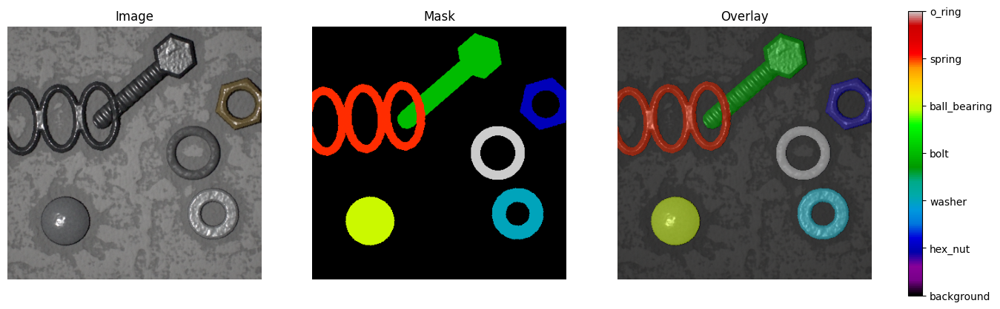
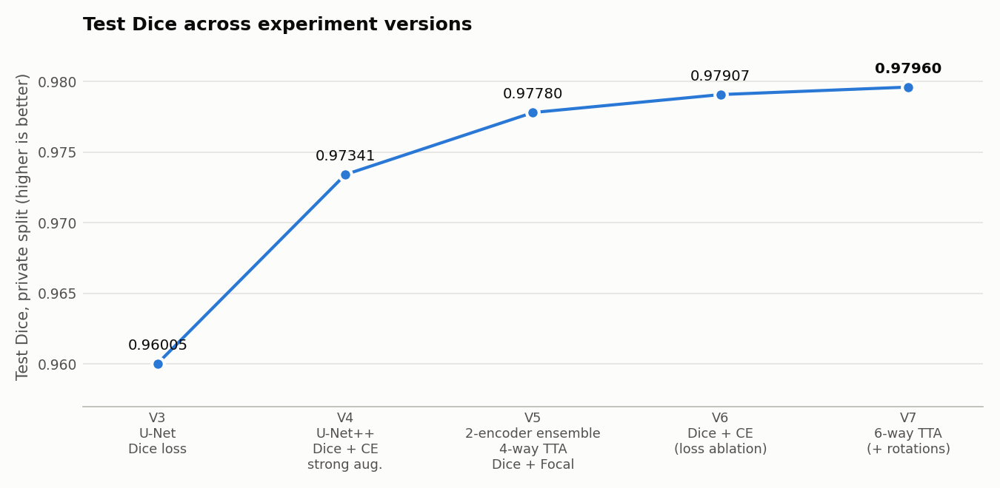
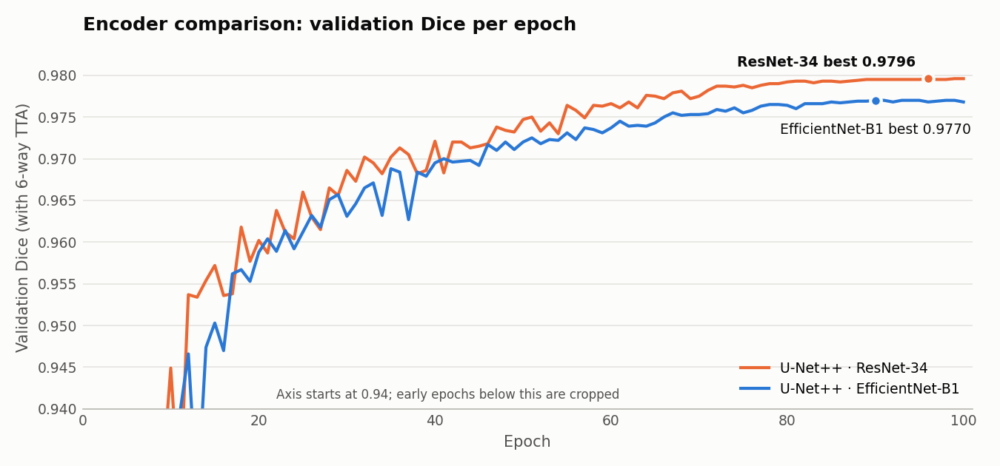
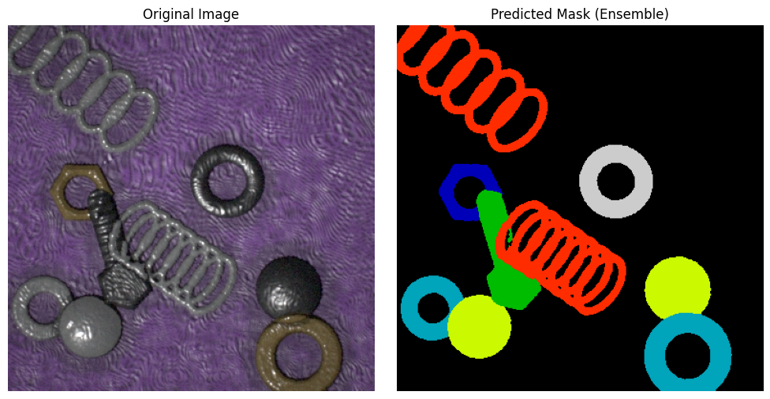

# Semantic Segmentation of Mechanical Parts with U-Net++

**Training encoder–decoder networks from scratch for 7-class pixel-level segmentation of industrial components**

## Abstract

We study multi-class semantic segmentation of **six mechanical part types** (hex nut, washer, bolt, ball bearing, spring, o-ring) in cluttered 384 × 384 industrial images. The parts are overlapping, thin-walled or hollow. All networks are trained **from scratch**, with no pretrained weights.

Over five iterative experiment versions, test Dice improved from **0.96005 to 0.97960**. Our main findings:

1. Moving from **U-Net to U-Net++** with a **Dice + Cross-Entropy** loss, stronger augmentation and longer training gave the largest single gain (+0.0134).
2. A **two-encoder ensemble** (ResNet-34 + EfficientNet-B1) with **test-time augmentation** and early stopping added a further +0.0044.
3. A controlled **loss ablation** showed Dice + Cross-Entropy outperforms Dice + Focal loss (+0.0013 test Dice) with everything else held fixed.
4. Adding **rotation-based TTA** (6 views instead of 4) gave the final +0.0005.
5. When training from scratch, **ResNet-34 consistently outperformed EfficientNet-B1** as the U-Net++ encoder, across all three repeated runs.

| | |
|---|---|
| **Task** | 7-class semantic segmentation (background + 6 parts), 384 × 384 RGB |
| **Data** | 2,000 labelled images (1,700 train / 300 validation) · 500 test images |
| **Architecture** | U-Net++ with ResNet-34 and EfficientNet-B1 encoders, trained from scratch (Kaiming init) |
| **Loss** | 0.5 · Dice + 0.5 · Cross-Entropy |
| **Training** | AdamW, cosine annealing, mixed precision, early stopping, 100 epochs |
| **Inference** | 6-way TTA → probability ensemble → missing-class recovery → RLE |
| **Best result** | **Test Dice 0.97960** (private split) · 0.98096 (public split) |
| **Baseline** | U-Net + ResNet-34, Dice loss: 0.96005 |

---

## 1. Introduction

### Problem

Given a 384 × 384 RGB image, assign every pixel to one of 7 classes:

| ID | Class | Geometry |
|---:|---|---|
| 0 | Background | Varied textured surfaces (e.g. wood, concrete) |
| 1 | `hex_nut` | Six-sided outer boundary with a central hole |
| 2 | `washer` | Thin circular ring with a central hole |
| 3 | `bolt` | Hexagonal head with a threaded shank |
| 4 | `ball_bearing` | Solid sphere |
| 5 | `spring` | Thin helical structure with repeating loops |
| 6 | `o_ring` | Circular ring with a rounded, tube-like cross-section |

The network outputs a `7 × 384 × 384` logit map, and each pixel takes the class with the highest probability.

### Why it is challenging

- **Thin and hollow structures.** Springs, washers and o-rings are mostly *holes*. Small boundary errors translate directly into large Dice losses.
- **Visually similar classes.** Washers and o-rings are both rings, and hex nuts and bolt heads share the same hexagonal outline.
- **Overlap and clutter.** Parts touch and overlap on textured backgrounds.
- **No pretraining.** Every encoder is trained from random initialisation, so the architecture, loss and augmentation have to carry the full learning burden.



*A training image, its ground-truth mask, and the overlay. Every image contains instances of all six part classes.*

---

## 2. Dataset

| Split | Images | Resolution | Labels |
|---|---:|---|---|
| Training | 2,000 | 384 × 384 × 3 | Integer masks, pixel values 0–6 |
| Test | 500 | 384 × 384 × 3 | Hidden; scored on a held-out evaluation set |

The labelled data is split with a fixed seed (42) into **1,700 training** and **300 validation** images (85 / 15). A metadata file also records each image's background type (e.g. wood, concrete), its number of parts, and the classes present.

Masks store class IDs directly as pixel values, so they must be loaded as integer arrays (`np.array(Image.open(path))`) and **never** converted to RGB. Converting would map class IDs to palette colours and silently corrupt the labels.

---

## 3. Evaluation metric

Performance is measured with the **Dice coefficient**, computed separately for every *(image, foreground class)* pair:

```math
\text{Dice}(P, G) = \frac{2\,|P \cap G|}{|P| + |G|}
```

where $P$ and $G$ are the predicted and ground-truth binary masks for that class. By convention, Dice is 1 if both masks are empty and 0 if exactly one is empty. The final score is the mean over all pairs:

```math
\text{Score} = \frac{1}{N \cdot 6} \sum_{i=1}^{N} \sum_{c=1}^{6} \text{Dice}\big(P_{i,c},\, G_{i,c}\big)
```

For the 500 test images this is an average over **3,000 image-class pairs**. Because each class counts separately in each image, **missing a class entirely in one image costs a full Dice point for that pair**. That motivates the missing-class recovery step (Section 4.7).

---

## 4. Methodology

```text
                 Image (384×384×3)
                        │
          ┌─────────────┴─────────────┐
          ▼                           ▼
 U-Net++ / EfficientNet-B1     U-Net++ / ResNet-34      (both trained from scratch)
          │                           │
          ▼                           ▼
     6-way TTA                   6-way TTA
          │                           │
          └─────────────┬─────────────┘
                        ▼
            Probability-level ensemble
                        ▼
                 Pixel-wise argmax
                        ▼
              Missing-class recovery
                        ▼
                 RLE-encoded masks
```

### 4.1 Architecture: U-Net++

U-Net++ [2] extends U-Net [1] by replacing the plain skip connections with **nested, densely connected skip pathways**. Encoder features pass through a series of intermediate convolution blocks before they reach the decoder, which narrows the *semantic gap* between encoder and decoder features. This helps with:

- thin boundaries and small structures (springs, washer rims);
- holes inside objects (nuts, washers, o-rings);
- objects at several scales in the same image.

We use the implementation from `segmentation_models_pytorch` [11] with two encoders:

| Encoder | Family | Design |
|---|---|---|
| **ResNet-34** [3] | Residual CNN | Residual blocks; a simple, robust hierarchy of features |
| **EfficientNet-B1** [4] | Compound-scaled CNN | MBConv blocks with squeeze-and-excitation; balanced depth, width and resolution |

```python
smp.UnetPlusPlus(encoder_name=encoder_name, encoder_weights=None, in_channels=3, classes=7)
```

`encoder_weights=None` means **no ImageNet pretraining**. Every convolutional and linear layer is initialised with **Kaiming normal initialisation** [7] (`mode="fan_in"`, `nonlinearity="relu"`, zero bias). This keeps activation variance stable through deep ReLU networks, with $\mathrm{Var}(W) \approx 2 / n_{\mathrm{in}}$, where $n_{\mathrm{in}}$ is the layer's fan-in.

### 4.2 Loss function

The final objective combines a region-level and a pixel-level term:

```math
\mathcal{L} = 0.5\,\mathcal{L}_{\text{Dice}} + 0.5\,\mathcal{L}_{\text{CE}}
```

- **Dice loss** [6] directly optimises mask overlap, the quantity being evaluated. It is also robust to foreground/background imbalance.
- **Cross-entropy** gives dense, well-behaved gradients at every pixel and sharpens class discrimination, for example washer vs o-ring.

Dice loss alone (Experiment V3) is noisy early in training and blind to confident per-pixel mistakes. Cross-entropy alone ignores region structure. The combination is a standard, strong choice for segmentation. We also tested **Dice + Focal loss** [5] (0.7 / 0.3, α = 0.25, γ = 2) in a controlled ablation (Section 5, V5 vs V6).

### 4.3 Data augmentation (Albumentations [12])

Geometric transforms are applied **jointly** to the image and mask, which preserves pixel correspondence.

| Transform | Setting | Probability | Purpose |
|---|---|---:|---|
| Horizontal flip | – | 0.5 | Parts have no preferred orientation |
| Vertical flip | – | 0.5 | Same |
| Random 90° rotation | – | 0.5 | Rotation invariance in a top-down view |
| Shift-scale-rotate | shift 0.1, scale 0.15, rotate ±45° | 0.7 | Position, size and arbitrary-angle variation |
| Brightness / contrast | ±0.2 | 0.5 | Lighting variation |
| Hue / saturation / value | 10 / 20 / 20 | 0.3 | Colour and material variation |
| One of: motion blur, Gaussian noise | – | 0.15 | Sensor blur and noise |
| Coarse dropout | – | 0.2 | Forces use of context around occluded regions |

Images are normalised with ImageNet statistics (mean `(0.485, 0.456, 0.406)`, std `(0.229, 0.224, 0.225)`). Validation and test images receive only normalisation.

> **Implementation note:** with the installed Albumentations version, the custom parameters for `GaussNoise` and `CoarseDropout` raised "invalid argument" warnings and were ignored. Both transforms therefore ran with library default settings.

### 4.4 Optimisation

| Setting | Value |
|---|---|
| Optimiser | AdamW [8], learning rate 1e-3, weight decay 1e-4 |
| Schedule | Cosine annealing [9] over 100 epochs |
| Precision | Automatic mixed precision (`torch.amp` autocast + GradScaler) [10] |
| Batch size | 8 |
| Early stopping | Patience 15 epochs on validation Dice |
| Checkpointing | Best validation Dice per encoder |
| Seed | 42 (Python, NumPy, PyTorch, CUDA) |

Mixed precision reduces memory use and speeds up training, which makes 100-epoch runs of two models practical on a single GPU.

### 4.5 Test-time augmentation (TTA)

Each image is predicted under several transformations. The softmax outputs are mapped back to the original orientation and averaged:

| Views | Transformations | Used in |
|---:|---|---|
| 4 | identity, horizontal flip, vertical flip, both flips | V5, V6 |
| 6 | the 4 above + 90° and 270° rotation | V7 (final) |

The parts appear in arbitrary orientations, so averaging over the symmetry group of the square smooths out orientation-specific errors. **TTA is also applied during validation**, so model selection optimises the same prediction procedure used at test time.

### 4.6 Model ensemble

The two independently trained U-Net++ models (different encoders, optimiser states, schedules and checkpoints) are combined **at the probability level** before `argmax`:

```math
p_{\text{ens}} = w \cdot p_{\text{EffNet-B1}} + (1 - w)\cdot p_{\text{ResNet-34}}
```

We used $w = 0.5$ for test predictions and $w = 0.4$ (favouring the stronger ResNet-34) for the final validation analysis.

### 4.7 Missing-class recovery

Every image contains all six part classes. If the `argmax` prediction for an image contains **no pixels at all** of some class $c$, that image-class pair would score Dice = 0. In that case:

1. Take the class-$c$ probability map.
2. Keep pixels with $p_c > 0.20$ as candidates.
3. If there are more than 150 candidates, keep the 150 most confident.
4. Assign those pixels to class $c$.

This is a deliberately conservative, data-aware heuristic. It only runs when a class has completely disappeared, and it turns a guaranteed zero into a chance of partial overlap. V4 used an earlier variant that assigned the top 150 pixels without a confidence threshold; V5 onwards added the 0.20 threshold.

---

## 5. Experiments

We developed the system iteratively. Each version was trained on the same seeded 1,700 / 300 split and scored on the held-out test set.

| Version | Changes from previous version | Validation Dice | Test Dice (private) | Test Dice (public) |
|---|---|---:|---:|---:|
| **V3** | Baseline: **U-Net** + ResNet-34 (scratch), **Dice loss**, flips + 90° rotations, 20 epochs | 0.9587 | 0.96005 | 0.96024 |
| **V4** | **U-Net++**, **Dice + CE**, full augmentation pipeline, 50 epochs, missing-class recovery | 0.9728 | 0.97341 | 0.97434 |
| **V5** | **Two encoders + ensemble**, **4-way TTA**, 100 epochs + early stopping, mixed precision, thresholded recovery, loss changed to **Dice + Focal** | 0.9772 † | 0.97780 | 0.97932 |
| **V6** | Loss reverted to **Dice + CE** (only change) | 0.9791 † | 0.97907 | 0.98079 |
| **V7** | **6-way TTA** (+ 90° / 270° rotations) | 0.9795 † | **0.97960** | **0.98096** |

† Ensemble validation Dice, including TTA and missing-class recovery. V3 and V4 validation scores are single-model scores without TTA. Validation numbers are therefore not directly comparable across all versions, so **test Dice is the primary comparison**.



### V3 → V4: architecture, loss and augmentation (+0.01336)

Replacing U-Net with **U-Net++**, switching from Dice-only to **Dice + Cross-Entropy**, adding **geometric, photometric, noise and dropout augmentation**, and training 2.5× longer gave the largest improvement. Several changes were made together here, so the gain reflects their combined effect.

### V4 → V5: ensembling, TTA and training schedule (+0.00439)

V5 introduced a **second encoder** (EfficientNet-B1) and a probability-level ensemble. It also added **4-way flip TTA** (in validation and test), extended training to **100 epochs** with **early stopping**, added **mixed precision**, and made missing-class recovery **confidence-thresholded**. The loss was changed to **Dice + Focal** at the same time.

### V5 → V6: loss ablation, Dice + Focal vs Dice + CE (+0.00127)

V6 is a **controlled ablation**: the only change is the loss function.

| Loss | EfficientNet-B1 (val) | ResNet-34 (val) | Ensemble (val) | Test Dice (private) |
|---|---:|---:|---:|---:|
| 0.7 · Dice + 0.3 · Focal | 0.9754 | 0.9770 | 0.9772 | 0.97780 |
| **0.5 · Dice + 0.5 · CE** | **0.9766** | **0.9797** | **0.9791** | **0.97907** |

Dice + CE was better **on both encoders, on validation and on test**. With all six classes present in every image, per-class imbalance is moderate. Focal loss's down-weighting of easy pixels seems to remove useful gradient signal, while full cross-entropy provides stronger per-pixel supervision for fine boundaries.

### V6 → V7: rotation TTA (+0.00053)

Extending TTA from 4 flip-based views to 6 views (adding 90° and 270° rotations) gave a small but consistent test improvement. Rotations add viewpoints that flips cannot produce, which suits objects that appear at arbitrary angles.

### Encoder comparison



| Run | EfficientNet-B1 best val Dice | ResNet-34 best val Dice |
|---|---:|---:|
| V5 | 0.9754 | **0.9770** |
| V6 | 0.9766 | **0.9797** |
| V7 | 0.9770 | **0.9796** |

Trained from scratch, **ResNet-34 outperformed EfficientNet-B1 in all three runs**, and it also learned faster early in training. A plausible explanation is that EfficientNet's compound-scaled MBConv blocks and squeeze-and-excitation layers get much of their advantage from large-scale pretraining. ResNet's plain residual blocks are easier to optimise from random initialisation on 1,700 images.

> **Ensemble vs best single model:** on validation, the ensemble matched but did not exceed ResNet-34 alone (V6: 0.9791 vs 0.9797; V7: 0.9795 vs 0.9796). EfficientNet-B1 is consistently weaker, so equal weighting may dilute the stronger model. Only ensemble predictions were submitted, so the effect on the test set was not measured directly. Weight tuning and a single-model test submission are listed as future work.

---

## 6. Final results

| Metric | Score |
|---|---:|
| **Test Dice, private split** | **0.97960** |
| Test Dice, public split | 0.98096 |
| Validation Dice, ensemble | 0.9795 |
| Validation Dice, ResNet-34 alone | 0.9796 |

The validation and private test scores agree to within 0.0001. The 300-image validation split was therefore a reliable estimate of generalisation.



*Final ensemble prediction on an unseen test image with a textured background. Overlapping springs, touching bearings and washers, and thin ring structures are all separated cleanly.*

### Convergence (ResNet-34, final run)

| Epoch | Train loss | Val Dice | Learning rate |
|---:|---:|---:|---:|
| 90 | 0.0328 | 0.9795 | 2.4e-5 |
| 93 | 0.0328 | 0.9795 | 1.2e-5 |
| 96 | 0.0318 | **0.9796** | 4e-6 |
| 99 | 0.0321 | **0.9796** | ~0 |
| 100 | 0.0321 | **0.9796** | ~0 |

As the cosine schedule approached zero, validation Dice settled within ±0.0001, so the model had converged. Early stopping never triggered: both encoders were still improving slowly through most of the 100 epochs.

---

## 7. Discussion

- **Architecture and loss drove most of the gain.** The V3 → V4 step (U-Net++ with Dice + CE) accounts for about 68% of the total improvement.
- **Loss choice matters, even between standard options.** The V5 → V6 ablation shows Dice + CE outperforming Dice + Focal on both encoders, with all other factors fixed.
- **Inference-time methods give small, reliable gains.** TTA and the move to 6 views improved test Dice at no training cost.
- **Encoder choice depends on the training regime.** Without pretraining, the simpler ResNet-34 consistently beat EfficientNet-B1.
- **Validation was trustworthy.** The final validation Dice (0.9795) matched the private test score (0.97960) almost exactly.

---

## 8. Limitations and future work

- **Confounded changes:** V4 and V5 each changed several components at once. Isolating the effect of U-Net++, each augmentation group, and early stopping needs one-factor ablations.
- **Ensemble weighting:** tune $w$ on validation (e.g. 0.2–0.5 for EfficientNet-B1), and compare against a ResNet-34-only submission.
- **Post-processing ablation:** measure missing-class recovery on its own, since it could add false-positive pixels.
- **Augmentation correctness:** update the `GaussNoise` / `CoarseDropout` arguments to the current Albumentations API and re-measure.
- **Architectures:** compare DeepLabV3+, and U-Net++ with deeper encoders (ResNet-50, EfficientNet-B3).
- **Losses:** Lovász-Softmax or boundary-aware losses for thin structures such as springs.
- **Pretraining:** quantify how much ImageNet-pretrained encoders would help, relative to training from scratch.

---

## 9. Implementation details

**Run-length encoding.** Test masks are submitted as RLE strings of `start length` pairs, one row per *(image, class)*, which gives 500 × 6 = **3,000 rows**. The encoding uses **column-major (Fortran) order**: pixels are numbered down columns, then across. A row-major flattening would silently produce wrong masks. The notebook implements both an encoder and a decoder, so the ordering can be checked.

```text
1   5   9   13
2   6   10  14      ← pixel numbering for a 4 × 4 mask
3   7   11  15
4   8   12  16
```

**Mask loading.** `np.array(Image.open(mask_path))` is correct. `Image.open(mask_path).convert("RGB")` is wrong, because it maps class IDs to palette colours.

**Validation split.** The split is fixed by the seed, so every experiment version was compared on the same 300 images.

---

## 10. Reproducibility

1. Place the dataset next to the notebook, or edit `DATASET_DIR`:

   ```text
   Dataset/
   ├── metadata.csv
   ├── train/
   │   ├── images/
   │   └── masks/
   └── test/
       └── images/
   ```

2. Install dependencies: `torch`, `segmentation-models-pytorch`, `albumentations`, `numpy`, `pandas`, `Pillow`, `matplotlib`.
3. Run all cells in `Segmentation_Experiment.ipynb` on a GPU. It trains both encoders for up to 100 epochs, evaluates the ensemble on validation, and writes `submission.csv`.

---

## 11. Repository structure

```text
.
├── README.md
├── Segmentation_Experiment.ipynb     # final pipeline (V7) with all training logs and figures
└── assets/
    ├── sample_image_mask.png         # image, ground-truth mask and overlay
    ├── experiment_progression.png    # test Dice across versions V3–V7
    ├── encoder_comparison.png        # validation Dice per epoch, both encoders
    └── ensemble_prediction.png       # final prediction on a test image
```

The dataset is not included in this repository.

---

## References

1. Ronneberger, O., Fischer, P., & Brox, T. (2015). *U-Net: Convolutional Networks for Biomedical Image Segmentation.* MICCAI.
2. Zhou, Z., Siddiquee, M. M. R., Tajbakhsh, N., & Liang, J. (2018). *UNet++: A Nested U-Net Architecture for Medical Image Segmentation.* DLMIA Workshop, MICCAI.
3. He, K., Zhang, X., Ren, S., & Sun, J. (2016). *Deep Residual Learning for Image Recognition.* CVPR.
4. Tan, M., & Le, Q. V. (2019). *EfficientNet: Rethinking Model Scaling for Convolutional Neural Networks.* ICML.
5. Lin, T.-Y., Goyal, P., Girshick, R., He, K., & Dollár, P. (2017). *Focal Loss for Dense Object Detection.* ICCV.
6. Milletari, F., Navab, N., & Ahmadi, S.-A. (2016). *V-Net: Fully Convolutional Neural Networks for Volumetric Medical Image Segmentation.* 3DV.
7. He, K., Zhang, X., Ren, S., & Sun, J. (2015). *Delving Deep into Rectifiers: Surpassing Human-Level Performance on ImageNet Classification.* ICCV.
8. Loshchilov, I., & Hutter, F. (2019). *Decoupled Weight Decay Regularization.* ICLR.
9. Loshchilov, I., & Hutter, F. (2017). *SGDR: Stochastic Gradient Descent with Warm Restarts.* ICLR.
10. Micikevicius, P., et al. (2018). *Mixed Precision Training.* ICLR.
11. Iakubovskii, P. *Segmentation Models PyTorch.* https://github.com/qubvel-org/segmentation_models.pytorch
12. Buslaev, A., et al. (2020). *Albumentations: Fast and Flexible Image Augmentations.* Information, 11(2).
